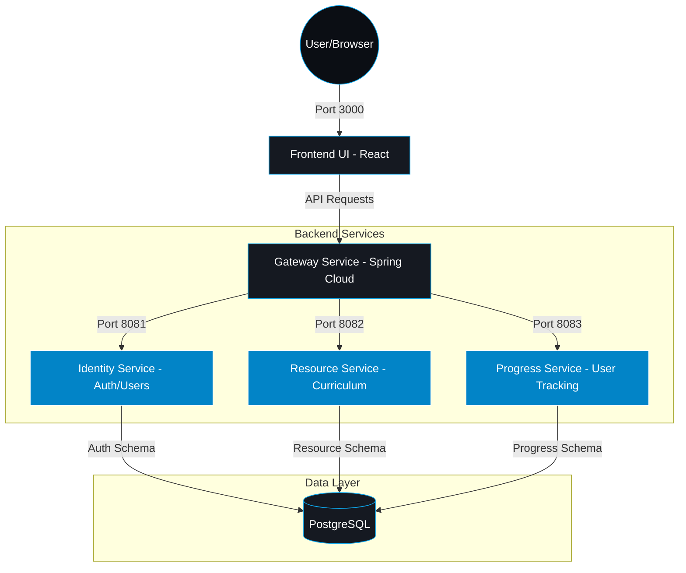

# 🌌 LuminaPath: Microservices Learning Platform

**LuminaPath** is a high-performance, containerized microservices ecosystem designed to provide structured learning roadmaps for modern software engineering. It centralizes high-quality educational resources into a single, cohesive dashboard, enabling developers to master **Java Full Stack** and **DevOps** through curated, phase-based paths.

---

## 🏗️ System Architecture

The following diagram illustrates how traffic flows from the user's browser through the Gateway to the various backend services and the shared database.



## 🛠️ Tech Stack

| **Layer** | **Technologies**                                              |
|-----------|---------------------------------------------------------------|
| Frontend  | React 18, Tailwind CSS, Lucide Icons, Axios                   |
| Gateway   | Spring Cloud Gateway, YAML Configuration                      |
| Identity  | Java 17, Spring Boot 3, Spring Security, JWT, Spring Data JPA |
| Resources | Java 17, Spring Boot 3, Spring Data JPA                       |
| Progress  | Java 17, Spring Boot 3, Spring Data JPA                       |
| Database  | PostgreSQL 15 (Multi-schema: auth_schema, resource_schema)    |
| DevOps    | Docker, Docker Compose, SQL Initialization Scripts            |

## 🚀 Getting Started

#### Prerequisites
 - **Docker** & **Docker Compose** installed. 
 - **Git** for version control.

#### Installation & Deployment
- [1] Clone the repository:
    ```bash
        git clone [https://github.com/pvss2A3/LuminaPath.git](https://github.com/pvss2A3/LuminaPath.git)
        cd LuminaPath
    ```
- [2] Launch the ecosystem:
    ```bash
        docker-compose up -d --build
    ```
- [3] Verify the services:
    - **Frontend UI:** http://localhost:3000
    - **API Gateway:** http://localhost:8080
    - **PgAdminL:** http://localhost:5050

## 📁 Project Modules
- [***`frontend-ui/`***](./frontend-ui): A modern dark-themed dashboard. Features include dynamic roadmap rendering based on database categories and an embedded content reader.

- [***`gateway-service/`***](./gateway-service): The central entry point. Handles CORS, routing, and ensures security by directing traffic to internal microservices via Spring Cloud Gateway.

- [***`identity-service/`***](./identity-service): Manages the security layer. Responsible for JWT issuance, user credential validation, and user-specific path preferences.

- [***`resource-service/`***](./resource-service): The content engine. Delivers curriculum data and categorizes resources into navigable learning phases.

- [***`progress-service/`***](./progress-service): Tracks individual user milestones, completed lessons, and roadmap advancement.

- [***`init-db/`***](./init-db): Contains SQL initialization scripts that automatically set up schemas and seed the curricula (Java & DevOps) on the first launch.

## 🔒 Security & Performance
- **JWT Authentication:** Stateless authentication ensures scalable security across the microservices.

- **Schema Isolation:** Dedicated PostgreSQL schemas for Auth, Resources, and Progress to ensure data integrity.

- **Containerization:** Every service is isolated within Docker, ensuring consistent environments from development to production.

## 📄 License
This project is licensed under the MIT License - see the LICENSE file for details.