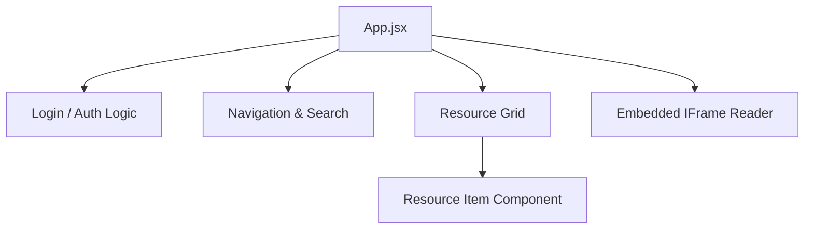

# 💻 LuminaPath Frontend UI

The **LuminaPath Frontend** is a modern, high-performance web dashboard built with **React** and **Vite**. It provides a sleek, dark-themed user experience designed for focus and productivity, allowing users to navigate complex learning roadmaps with ease.

---

## 🚀 Key Features

* **Dynamic Curriculum Rendering**: Automatically generates tabs and roadmaps based on categories provided by the Resource Service.
* **Integrated Content Reader**: Features an embedded I18n-ready iFrame reader for documentation and blogs.
* **Interactive Roadmaps**: Displays phase-based learning paths for Java and DevOps when categories are selected.
* **Global Search**: Real-time filtering of resources by title, provider, or description.
* **Secure Session Handling**: Manages JWT storage and provides automatic redirection based on authentication state.

---

## 🏗️ UI Architecture

The frontend follows a component-based architecture for high maintainability.



## 🛠️ Tech Stack
- **Core:** React 18 (Vite)
- **Styling:** Tailwind CSS (Utility-first CSS)
- **Icons:** Lucide React 
- **API Client:** Axios with interceptors for JWT injection 
- **State Management:** React Hooks (useState, useEffect)

## 📂 Project Structure
- *`src/api/`*: Centralized Axios configuration and API helper functions. 
- *`src/components/`*: Reusable UI components (Login, Resource Cards). 
- *`src/App.jsx`*: The main application controller handling routing and global state. 
- *`tailwind.config.js`*: Custom theme configuration for the "Lumina" dark-mode aesthetic.

## 🚀 Development Setup
#### Prerequisites
- **Node.js** (v18 or higher)
- **npm**

#### Installation
- [1] Navigate to the frontend directory:
    ```bash 
        cd frontend-ui
    ```
- [2] Install dependencies:
    ```bash 
        npm install
    ```
- [3] Start the development server:
    ```bash 
        npm run dev
    ```

## 🎨 UI Aesthetics
LuminaPath uses a custom dark-mode palette:
- **Primary Background:** #0B0E14 
- **Card Background:** #151921 
- **Accent Color:** Sky-500 (#0EA5E9)
- **Success/Read Color:** Emerald-500

## 📄 Note on External Content
To ensure a secure experience, the frontend distinguishes between **VIDEO** content (opened in new tabs to bypass YouTube's iFrame restrictions) and **BLOG** content (rendered in the internal reader).