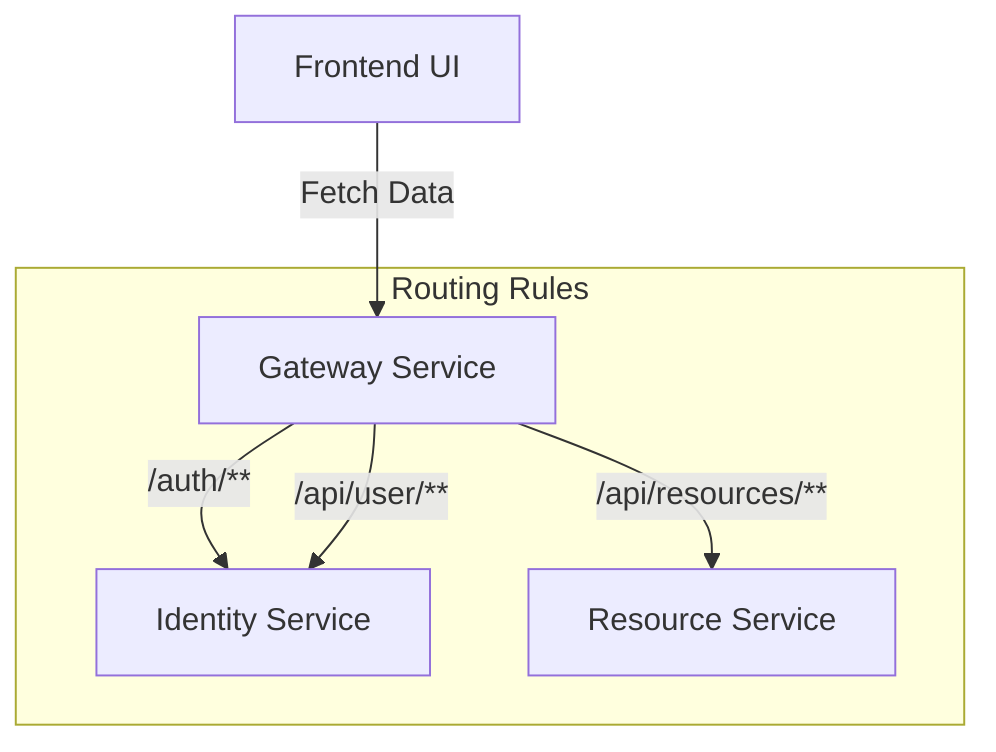

# 🚪 Gateway Service (LuminaPath)

The **Gateway Service** is the central entry point for the LuminaPath ecosystem. Built using **Spring Cloud Gateway**, it acts as a reverse proxy that routes requests from the Frontend UI to the appropriate backend microservices while handling cross-cutting concerns like security and CORS.

---

## 🚀 Key Features

* **Centralized Routing**: Routes traffic to internal services based on URL path predicates.
* **CORS Management**: Handles Cross-Origin Resource Sharing to allow the React frontend to communicate with various backends.
* **Request Filtering**: Provides a layer of abstraction between the client and internal service addresses.
* **Load Balancing Ready**: Configured to work with service discovery (like Eureka) for horizontal scaling.

---

## 🏗️ Routing Logic

The Gateway is configured via `application.yml` to direct traffic as follows:



## 🛠️ Tech Stack
- **Runtime:** Java 17 
- **Framework:** Spring Boot 3.x 
- **Gateway:** Spring Cloud Gateway 
- **Configuration:** YAML-based routing definitions

## 🔗 Route Definitions
| **Predicate (Path)**	 | **Destination**	             | **Service**      |
|-----------------------|------------------------------|------------------|
| /auth/**	             | http://identity-service:8081 | Identity Service |
| /api/user/**	         | http://identity-service:8081 | Identity Service |
| /api/resources/**     | http://resource-service:8082 | Resource Service |

## ⚙️ Configuration Snippet
The routing logic is defined in the *`src/main/resources/application.yml`* file:
```yaml
    spring:
    cloud:
      gateway:
        routes:
          - id: identity-service
            uri: lb://identity-service
            predicates:
              - Path=/auth/**, /api/user/**
          - id: resource-service
            uri: lb://resource-service
            predicates:
              - Path=/api/resources/**
```

## 🛡️ Security Note
The Gateway is the only service exposed to the public internet (via Docker port mapping). 
All other microservices (*`identity-service`*, *`resource-service`*) reside on the internal Docker network, protected from direct external access.

## 📄 Deployment
The Gateway runs on port **8080**. It depends on the health of the backend services to function correctly.
Ensure all services are up in the Docker network before testing routes.