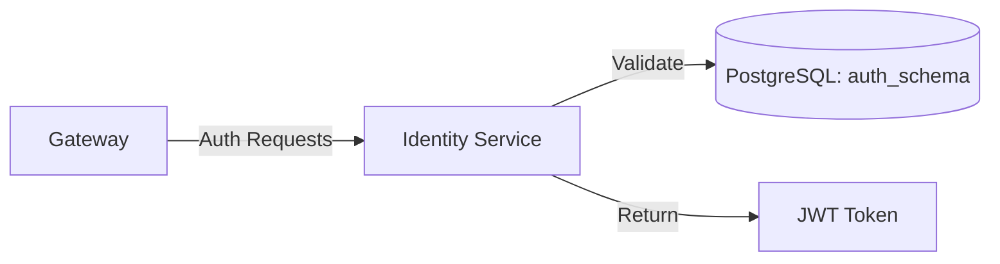

# 🔐 Identity Service (LuminaPath)

The **Identity Service** is the security backbone of the LuminaPath ecosystem. Built with Spring Boot and Spring Security, it handles all aspects of user authentication, authorization, and personalized path preferences.

---

## 🚀 Key Features

* **Stateless Authentication**: Uses JSON Web Tokens (JWT) for secure, scalable session management.
* **User Management**: Handles user registration and login validation.
* **Path Preferences**: Manages user-selected learning categories using native SQL optimizations.
* **Secure Password Storage**: Implements BCrypt hashing for credential protection.

---

## 🏗️ Technical Architecture

This service operates within the `auth_schema` of the PostgreSQL database to ensure strict data isolation from learning resources.



## 🛠️ Tech Stack
- **Runtime:** Java 17 
- **Framework:** Spring Boot 3.x 
- **Security:** Spring Security & JJWT (Java JWT)
- **Persistence:** Spring Data JPA & Hibernate 
- **Database:** PostgreSQL

## 📂 Module Structure
- [***`controller/`***](./src/main/java/com/luminapath/identity/controller): REST endpoints for /auth and /api/user. 
- [***`model/`***](./src/main/java/com/luminapath/identity/model): JPA entities, specifically the UserCredential entity. 
- [***`repository/`***](./src/main/java/com/luminapath/identity/repository): Data access layer using custom native queries for performance. 
- [***`service/`***](./src/main/java/com/luminapath/identity/service): Business logic for token generation and credential validation. 
- [***`config/`***](./src/main/java/com/luminapath/identity/config): Configuration for Authorization handling.

## 🔗 API Endpoints

| **Method** | **Endpoint**          | **Description**                   |
|------------|-----------------------|-----------------------------------|
| POST       | /auth/register        | Create a new student account      |
| POST       | /auth/token           | Authenticate and receive a JWT    |
| GET        | /auth/validate        | Verify if a token is still active |
| POST       | /api/user/preferences | Save selected learning paths      |
| GET        | /api/user/preferences | Retrieve user-specific paths      |

## ⚙️ Configuration
The service is configured to run on port `8081` within the Docker network. 
Connection details are managed via environment variables in the root `docker-compose.yml` file.

```yaml
  server:
  port: 8081
  spring:
    datasource:
      url: jdbc:postgresql://postgres:5432/luminapath
```

## 📄 Documentation Note
This service is designed to be internal. All external traffic must flow through the **Gateway Service** to ensure proper CORS handling and request filtering.