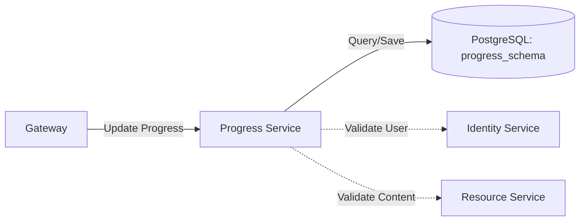

# 📈 Progress Service (LuminaPath)

The **Progress Service** is responsible for tracking user engagement and curriculum completion. It provides the logic for marking lessons as complete, calculating overall roadmap progress, and persisting user milestones.

---

## 🚀 Key Features

* **Milestone Tracking**: Records which specific resources or lessons a user has completed.
* **Progress Analytics**: Calculates percentage-based completion for specific learning paths (e.g., "Java Full Stack").
* **State Management**: Maintains a history of user activity within the learning journey.
* **Schema Isolation**: Operates within the dedicated `progress_schema` to ensure clean data separation from content and identity data.

---

## 🏗️ Architecture & Data Flow

The Progress Service interacts with the Identity Service (for User ID context) and the Resource Service (to validate content IDs).



## 🛠️ Tech Stack

- **Runtime**: Java 17 
- **Framework**: Spring Boot 3.x 
- **Persistence**: Spring Data JPA 
- **Database**: PostgreSQL 15 
- **Mapping**: Hibernate with custom progress_schema mapping

## 📂 Module Structure
- [***`controller/`***](./src/main/java/com/luminapath/progress/controller): Endpoints for updating and fetching user learning stats. 
- [***`model/`***](./src/main/java/com/luminapath/progress/model): Contains the UserProgress entity (mapping User IDs to Resource IDs). 
- [***`repository/`***](./src/main/java/com/luminapath/progress/repository): Handles persistence logic using optimized Spring Data JPA interfaces. 
- [***`service/`***](./src/main/java/com/luminapath/progress/service): Contains business logic for calculating completion percentages and validating milestones.

## 🔗 API Endpoints
| **Method** | **Endpoint**                        | **Description**                               |
|------------|-------------------------------------|-----------------------------------------------|
| GET        | /api/progress                       | Get progress summary for the logged-in user   |
| POST       | /api/progress/complete/{resourceId} | Mark a specific lesson/resource as finished   |
| DELETE     | /api/progress/reset/{categoryId}    | Reset progress for a specific learning path   |
| GET        | /api/progress/stats                 | Retrieve detailed analytics for the dashboard |


## ⚙️ Configuration
The service runs on port *`8083`*. It is configured to handle user-specific data transactions within the shared PostgreSQL instance.
```yaml
    server:
    port: 8083
    spring:
      datasource:
        url: jdbc:postgresql://postgres:5432/luminapath
      jpa:
        properties:
          hibernate:
            default_schema: progress_schema
```

## 📊 Database Logic
This service uses a junction-style table in the *`progress_schema`* to link *`user_id`* (from Identity) with *`resource_id`* (from Resources), along with a *`completion_timestamp`* and *`status`* flag.

## 📄 Note
Requests to this service must be authenticated. 
The Gateway Service forwards the JWT token, which this service can use to extract the *`userId`* for data operations.