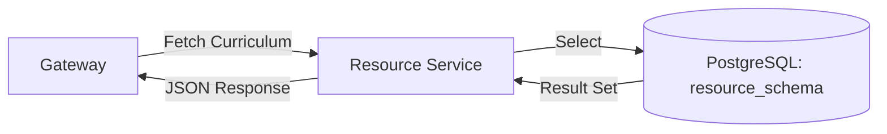

# 📚 Resource Service (LuminaPath)

The **Resource Service** is the content delivery engine of the LuminaPath platform. It manages the library of learning materials, including videos, books, and interactive tutorials, and organizes them into structured curricula.

---

## 🚀 Key Features

* **Curriculum Management**: Serves curated lists of resources for Java Full Stack and DevOps & Cloud paths.
* **Metadata Rich**: Tracks provider info, content types (Video/Blog), and direct URLs for every resource.
* **Schema Isolation**: Operates within the `resource_schema` to maintain clear separation from user authentication data.
* **Native Query Optimization**: Uses high-performance SQL to retrieve full curricula with minimal latency.

---

## 🏗️ Data Flow

The Resource Service acts as a read-heavy provider, fetching organized data for the Frontend UI.



## 🛠️ Tech Stack
- **Runtime:** Java 17 
- **Framework:** Spring Boot 3.x 
- **Persistence:** Spring Data JPA 
- **Database:** PostgreSQL 15 
- **Mapping:** Hibernate

## 📂 Module Structure
- *`controller/`*: Exposes the *`/api/resources`* endpoint for the dashboard. 
- *`model/`*: Contains the *`Resource`* entity representing a single learning unit. 
- *`repository/`*: Handles database interactions within the *`resource_schema`*. 
- *`dto/`*: Ensures API responses only contain necessary frontend metadata.

## 🔗 API Endpoints
| Method | Endpoint             | Description                             |
|--------|----------------------|-----------------------------------------|
| GET    | /api/resources       | Fetch all available learning resources  |
| GET    | /api/resources/{id}  | Fetch specific resource details         |

## ⚙️ Configuration
The service is configured to run on port *`8082`*. 
It relies on the `*init-db`* scripts to populate the *`resource_schema.resources`* table on startup.
```yaml
    server:
    port: 8082
    spring:
      datasource:
        url: jdbc:postgresql://postgres:5432/luminapath
      jpa:
        properties:
          hibernate:
            default_schema: resource_schema
```

## 📊 Content Categories
Currently, the service seeds and serves two primary domains:
- [1] **Java Full Stack:** Covers Core Java, Spring Boot, DSA, and Interview Preparation. 
- [2] **DevOps & Cloud:** Covers Linux, Docker, Kubernetes, CI/CD, and Infrastructure as Code.

## 📄 Note on External Links
All URLs served by this service are validated to ensure they point to high-quality, relevant educational content. 
Some resources may require opening in a new tab if the provider restricts iFrame embedding.